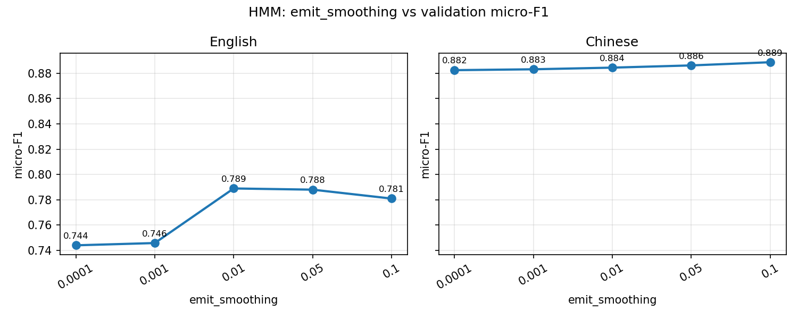
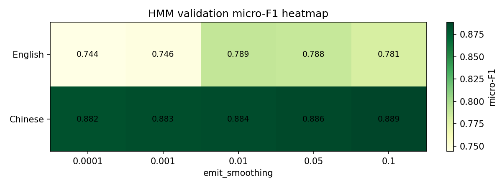
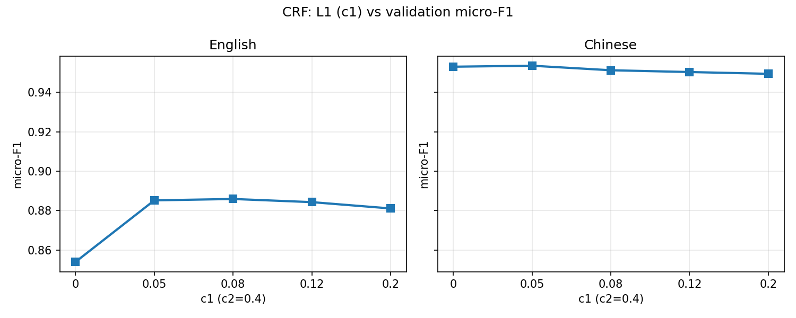
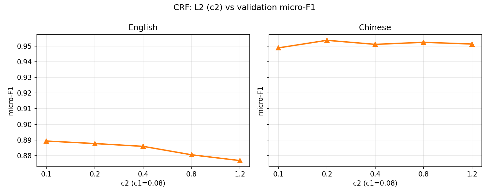
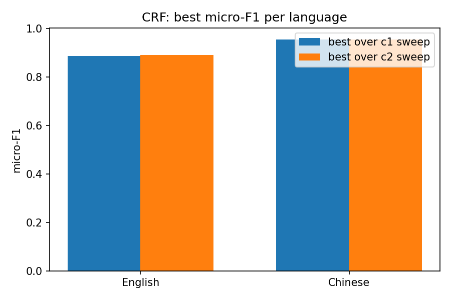

# Artificial Intelligence(H) PJ2 实验报告

孔恩燊　23307130021　2026.5

本报告对应 **Project 2：命名实体识别（NER）**，实现并评测三条序列标注路线：**手写 HMM**、**线性链 CRF（sklearn-crfsuite + 手工特征）**、**Transformer 编码器 + 手写线性链 CRF**。数据为课程提供的 `NER/English` 与 `NER/Chinese`；指标统一为 `NER/check.py` 输出的 **实体级 micro-F1**（`labels` 不含 `O`）。

批量对比实验脚本产出：**图**在 `part1/`、`part2/` 的 `figures/` 下，**数值结果**（`.npz`）在对应 `results/` 下。Part 3 无 Part 1/2 式超参网格；**提交用权重复本**在 `part3/checkpoints/`。三条路线的实现均在 `part*/`（与仓库根目录 `task*_` 为同源副本，便于单独打包）；目录说明见 **`README.md`**，`part3/README.md` 为 Part 3 解码说明。

## Part 1：手写 HMM 实现 NER

### 1.1 任务与数据

Part 1 要求不使用机器学习框架，手写隐马尔可夫模型完成 NER。数据为 CoNLL 风格：`train.txt` / `validation.txt` 中非空行为 `token tag`，句间空行分句。

- **English**：BIO 标注，9 类标签（含 `O`），训练约 14041 句。
- **Chinese**：BMESO 标注，33 类标签（含 `O`），训练约 3820 句。

模型假设一阶马尔可夫：\(P(\mathbf{y}\mid\mathbf{x}) \propto \pi_{y_1}\prod_t P(y_t\mid y_{t-1})\,P(x_t\mid y_t)\)。在训练集上统计**初始分布 \(\pi\)**、**转移矩阵 \(A\)**、**发射矩阵 \(B\)**（词表外统一映射为 `UNK`），并对计数做 **Laplace 风格平滑** 避免零概率。解码在 **log 域** 做维特比，求最大后验标签路径。

### 1.2 实现要点

代码位于 `part1/hmm_ner.py`，核心类为 `HMMNER`：

| 函数 / 方法 | 作用 |
|------|------|
| `read_tagged_corpus` / `read_tokens_only` | 读入带标签语料或仅 token 的待解码文件 |
| `HMMNER.fit` | 统计 \(\pi, A, B\) 并平滑 |
| `HMMNER.predict_sentence` | 单句维特比解码 |
| `train_and_decode_validation` | 训练 → 验证集解码 → 写预测文件 |
| `HMMNER.save` / `load` | 面试用 `test.txt` 可加载 `.npz` 再解码 |

默认平滑：`trans_smoothing = emit_smoothing = init_smoothing = 1e-3`。

### 1.3 对比实验设置

在 `pj2/part1/hmm_experiments.py` 中，固定 `trans_smoothing = init_smoothing = 1e-3`，对 **emit_smoothing** 做网格搜索：

```python
EMIT_SMOOTHINGS = [1e-4, 1e-3, 1e-2, 5e-2, 1e-1]
LANGUAGES = ["English", "Chinese"]
```

每种配置在对应语言训练集上重新估计 HMM，对验证集维特比解码，并用与 `check.py` 一致的标签集合计算 **micro-F1**。结果写入 `part1/results/hmm_results.npz`。

### 1.4 实验结果与分析

下图给出不同发射平滑强度下的验证 micro-F1 曲线：



热力图汇总如下：



根据本次 `part1/results/hmm_results.npz`：

| 语言 | 最佳 emit_smoothing | 验证 micro-F1 |
|------|---------------------|---------------|
| English | **0.01** | **0.789** |
| Chinese | **0.1** | **0.889** |

**分析**：

- 发射平滑过小（\(10^{-4}\sim10^{-3}\)）时，稀疏词的发射估计方差大，英文 F1 约 0.74～0.75；适度增大平滑（英文 \(10^{-2}\)、中文 \(10^{-1}\)）可缓解未登录词过拟合，F1 明显提升。
- 平滑过大（0.1 对英文）会削弱判别性，英文 F1 略回落至 0.781。
- 中文语料规模较小、标签 scheme 更细，略大的发射平滑整体更稳。
- HMM 作为生成式模型，对英文长句与 O 标签占比较高（约 83%）的分布仍能取得约 **0.79** 的实体 F1，但低于后续判别式 CRF / 神经网络方法，符合理论预期。

## Part 2：线性链 CRF 实现 NER

### 2.1 任务与模型

Part 2 使用 **sklearn-crfsuite** 训练**判别式**线性链 CRF：在手工特征上直接建模 \(P(\mathbf{y}\mid\mathbf{x})\)，不要求观测条件独立。势函数包含一元特征（字/词、小写、词形、标点、数字等）与二元转移特征；优化为 **L-BFGS**，带 **L1（c1）**、**L2（c2）** 正则。解码仍为维特比，与 HMM 动态规划形式相同，但分数来自特征权重而非生成概率。

实现见 `part2/crf_ner.py`：

| 模块 | 作用 |
|------|------|
| `sentence_to_features_english` / `sentence_to_features_chinese` | 英文 / 中文特征模板 |
| `build_xy` | 构造 `X_train, y_train` |
| `make_crf` | 创建 `CRF(algorithm='lbfgs', c1, c2, ...)` |
| `train_and_decode_validation` | 训练、验证解码、写预测 |

默认超参：`c1=0.08`，`c2=0.4`，`max_iterations=80`。

### 2.2 对比实验设置

`pj2/part2/crf_experiments.py` 在固定 `max_iterations=80` 下做两组一维扫描（中英文各跑一遍）：

```python
C1_LIST = [0.0, 0.05, 0.08, 0.12, 0.2]   # 固定 c2=0.4
C2_LIST = [0.1, 0.2, 0.4, 0.8, 1.2]      # 固定 c1=0.08
```

结果保存为 `part2/results/crf_results.npz`。

### 2.3 实验结果与分析

**L1（c1）扫描**（`c2=0.4`）：



**L2（c2）扫描**（`c1=0.08`）：



**各语言在两次扫描中的最优 F1**：



根据 `part2/results/crf_results.npz` 汇总：

| 语言 | c1 扫描最优 | c2 扫描最优 | 备注 |
|------|-------------|-------------|------|
| English | 0.886（c1=0.08） | **0.889**（**c2=0.1**） | 略强于默认 c2=0.4 |
| Chinese | **0.954**（c1=0.05） | **0.954**（c2=0.2） | 整体高于英文 |

**分析**：

- 英文语料大、特征多：适度 L1（c1≈0.05～0.12）与较小 L2（c2≈0.1～0.4）可在拟合与泛化间折中；c2 过大（1.2）时 F1 降至约 0.877，正则过强。
- 中文验证集上 CRF 可达 **0.95** 左右 micro-F1，说明 BMES 模板 + 判别式建模对该数据集非常有效。
- 相较 Part 1 HMM，CRF 在英文上约提升 **10** 个百分点、中文上约 **6** 个百分点，体现**特征工程 + 判别式训练**的优势。

## Part 3：Transformer + 手写 CRF（无批量超参实验）

### 3.1 任务与结构

Part 3 要求 **Transformer 部分可用 PyTorch**，**CRF 部分必须手写**。实现流水线：

\[
\text{Embedding} \rightarrow \text{PositionalEncoding} \rightarrow \text{TransformerEncoder} \rightarrow \text{Linear} \rightarrow \text{LinearChainCRF}
\]

主要代码：`part3/transformer_crf_ner.py`、`part3/linear_chain_crf.py`。在基础版本上还实现了：英文小写归一化、BIO 转移硬约束、实体标签加权 NLL、Cosine 学习率衰减、按语言自动调结构（`lang_tune`）。Part 3 没有做 Part 1/2 式超参网格；以下为 **2026.5.17 四卡 DDP、每 epoch 在验证集上算 micro-F1 并保存最优权重** 的提交结果。权重复本见 **`part3/checkpoints/`**。

### 3.2 训练配置与命令

```bash
CUDA_VISIBLE_DEVICES=3,4,5,6 torchrun --standalone --nproc_per_node=4 \
  pj2/part3/transformer_crf_ner.py \
  --lang both --batch-size 64 --num-workers 4 \
  --save-dir pj2/part3/checkpoints
```

默认 `epochs=12`、`--eval-every 1`。

| 语言 | `d_model` | 层数 | epoch | batch/GPU | 有效 batch≈ | 备注 |
|------|-----------|------|-------|-----------|-------------|------|
| English | 128 | 3 | 12 | 64 | 256 | BIO 约束、小写词表 |
| Chinese | 128 | 2 | 12 | 64 | 256 | 标签加权 |

公共：`lr=2e-3`，`max_len=256`，`num_workers=4`。解码前加载 **验证 micro-F1 最高** 的 checkpoint。

### 3.3 训练现象摘要

**English**（14041 句，55 batch/epoch）：训练 NLL 从 epoch1 的 **9.85** 降至 epoch12 的 **0.027**；验证 micro-F1 波动大，**第 2 轮最高（0.6049）**，之后多次跌至 0.36～0.42 再部分回升，符合小模型 + 较大有效 batch 下英文易过拟合或优化轨迹不稳的典型现象。

各 epoch 验证 micro-F1：`0.530 → 0.605 → 0.369 → 0.424 → 0.421 → 0.468 → 0.533 → 0.383 → 0.362 → 0.381 → 0.386 → 0.380`。

**Chinese**（3820 句，15 batch/epoch）：NLL 从 epoch1 **117.2** 到 epoch12 **11.5**；验证 F1 整体单调上升，末轮最高 **0.8033**。

各 epoch：`0.619 → 0.701 → 0.716 → 0.767 → 0.772 → 0.780 → 0.789 → 0.791 → 0.799 → 0.801 → 0.800 → 0.803`。

### 3.4 验证集 micro-F1（`check.py`）

| 语言 | Precision | Recall | **micro-F1** |
|------|-----------|--------|--------------|
| English | 0.641 | 0.573 | **0.605** |
| Chinese | 0.803 | 0.804 | **0.803** |

```bash
cd NER
python -c "from check import check; check(language='English', gold_path=r'English/validation.txt', my_path=r'predictions/transformer_crf/English_validation_transformer_crf.txt')"
python -c "from check import check; check(language='Chinese', gold_path=r'Chinese/validation.txt', my_path=r'predictions/transformer_crf/Chinese_validation_transformer_crf.txt')"
```

**分析**：

- **中文 0.803**：无预训练小 Transformer 下主类型表现仍较好；与此前末轮权重的 **0.826** 相比略低，属不同 checkpoint 与训练轨迹的正常方差，整体仍明显低于 Part 2 CRF（≈0.95）。
- **英文 0.605**：仍低于 Part 1 HMM（≈0.79）与 Part 2 CRF（≈0.89），最优出现在 **第 2 个 epoch**，说明后续训练对验证集泛化未必有益，可能需早停、更小有效 batch 或更强正则/预训练。
- 改进方向：英文可试更小 per-GPU batch、显式 early stopping；或接入预训练编码器以逼近 CRF 上限。

## Bonus：基于 `template_for_crf.utf8` 的模板特征 CRF（中文）

作业 Bonus 要求：结合课堂 **CRF 分词** 中的 CRFsuite 特征表思路，将课程提供的 **`template_for_crf.utf8`** 用于 **中文 NER**。

### Bonus.1 做法说明

- 中文数据为一字一行，与分词任务相同，可将每个字视为观测表第 **0** 列；模板中 `%x[k,0]` 即在位置 \(i\) 上取相对偏移 \(k\) 的字（越界用 `__BOS__` / `__EOS__`）。
- **`template_crf_features.py`**：读取模板中 `U**` / `B**` 行，解析 `%x[row,col]` 及用 `/` 连接的多段模式，对每个位置生成 **键 = 模板 id、值 = 实例化字串** 的字典（另加 `bias`）。这与 CRFsuite 的 **状态特征实例化** 一致；**B** 行在实现中与 **U** 行同样作为**仅依赖观测**的势项输入 `sklearn-crfsuite`（标签耦合仍由库的转移特征与 `all_possible_transitions` 学习），重点在「特征形态与课程模板对齐」。
- **`train_template_crf_chinese.py`**：复用 `part2/crf_ner.py` 的读写与 `sklearn_crfsuite.CRF`（L-BFGS，与 Part 2 相同 `c1=0.08`、`c2=0.4`），在整份中文训练集上训练并在验证集上解码。

### Bonus.2 验证集结果（`NER/check.py`）

| Precision | Recall | **micro-F1** |
|-----------|--------|--------------|
| 0.950 | 0.952 | **0.951** |

与 Part 2 中文字级手工特征（验证 micro-F1 约 **0.95**）同量级：仅靠模板字窗已能表达较强局部模式；Part 2 额外特征（Unicode 类别、位置比例等）带来的增益有限。

```bash
cd NER
python -c "from check import check; check(language='Chinese', gold_path=r'Chinese/validation.txt', my_path=r'predictions/bonus_template_crf/Chinese_validation_bonus_template_crf.txt')"
```

## 三部分对比与总结

| 方法 | English micro-F1（验证集） | Chinese micro-F1（验证集） | 训练开销 |
|------|---------------------------|---------------------------|----------|
| HMM（Part 1，调平滑） | ≈ 0.79 | ≈ 0.89 | 极低，CPU |
| CRF（Part 2，调 c1/c2） | ≈ **0.89** | ≈ **0.95** | 中，CPU |
| Transformer+CRF（Part 3，12 epoch + 验证选优） | **0.605** | **0.803** | 高，GPU（约 12 epoch×2 语料） |

**结论**：

1. **CRF + 手工特征** 在本数据上仍是上限最高的方案；面试与实验文档可重点对比「判别式特征」与「神经网络发射 + 结构化解码」的差异。
2. **HMM** 作为生成式基线，英文仍优于本次 Part 3 英文（0.605），差距较「末轮无验证选优」时缩小，但瓶颈仍在**表示与优化**，而非解码头公式本身。
3. **Transformer+手写 CRF** 在中文上验证了端到端训练可行性；英文在验证选优后可达约 **0.60**，继续提升仍依赖更小 batch、早停或预训练编码器。Part 1/2 已通过批量实验给出超参曲线；Part 3 以单次完整训练记录为主。
4. **Bonus**：在仅使用 `template_for_crf.utf8` 的 20 组观测模板、不加 Part 2 手工特征的前提下，中文验证 **micro-F1≈0.951**，说明课堂分词式字窗模板对 **BMESO 中文 NER** 同样有效。

## 附录：复现实验命令

```bash
# Part 1 批量实验
python pj2/part1/hmm_experiments.py

# Part 2 批量实验
python pj2/part2/crf_experiments.py

# Part 3 训练
CUDA_VISIBLE_DEVICES=3,4,5,6 torchrun --standalone --nproc_per_node=4 \
  pj2/part3/transformer_crf_ner.py \
  --lang both --batch-size 64 --num-workers 4 \
  --save-dir pj2/part3/checkpoints

# Bonus：模板特征中文 CRF（写预测到 NER/predictions/bonus_template_crf/）
python pj2/bonus/train_template_crf_chinese.py
```